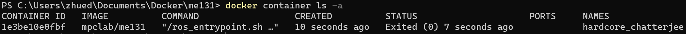

# Docker Environment Setup for ME 131 Class Project

This document includes instructions for setting up the Docker container which will provide the development environment for the ME 131 class project.

## Overview

The Docker container runs an instance of Ubuntu 20.04 with ROS2 Foxy and certain Python 3 packages preinstalled. The goal is to provide you with a development environment that closely mimics the one used in the MPC Lab. This environment will allow you to easily test your code in simulation and to ensure a straightforward transition of your final demonstration to the BARC hardware platform in the lab.

### Key Components
* Ubuntu 20.04 Focal Fossa
* ROS 2 Foxy
* Python 3.8

## Docker Installation

### Windows 10 and 11

Please follow the instructions [here](https://docs.docker.com/desktop/install/windows-install/) (https://docs.docker.com/desktop/install/windows-install/). Make sure to follow the instructions pertaining to the installation of WSL 2 as a prerequisite.

***NOTE***: You must launch the Docker Desktop application before running any `docker` commands. Docker commands were tested in PowerShell.

### Linux

Please follow the instructions [here](https://docs.docker.com/desktop/install/linux-install/) (https://docs.docker.com/desktop/install/linux-install/)

***NOTE***: Docker commands must be run with `sudo` on Linux systems.

### Mac OS

Please follow the instructions [here](https://docs.docker.com/desktop/install/mac-install/) (https://docs.docker.com/desktop/install/mac-install/)

***NOTE***: The installation instructions are diffrent depending on whether your Mac uses an Apple or Intel CPU. See [here](https://support.apple.com/en-us/HT211814) for a list of Macs with Apple silicon. You must launch the Docker Desktop application before running any `docker` commands.

## Obtaining the Image from DockerHub

The Docker image which will be used in the class is hosted on [DockerHub](https://hub.docker.com/repository/docker/mpclab/me131). After installing Docker on your machine, make sure you have a working Internet connection and open up a terminal and run the command:

```
docker pull mpclab/me131
```

This will download the image from DockerHub onto your machine.

## Working with Containers

### Launching a Container with the Image

The most basic command for launching a Docker container with the image we just downloaded is as follows:

```
docker run -it mpclab/me131
```

Running this command should drop you into a `bash` shell running inside the container which allows you to interact with the contents of the container and to run executables. You should see the command line prompt change to something like:

```
root@c61471807e47:/#
```

The alphanumeric string after the `@` symbol is the container ID and will change everytime you launch a new container of the image.

***NOTE***: You may modify the contents of the container by adding files or installing new packages, but once you log out and delete the instance, all of those changes will be lost.

### Stopping the Container

To log out and stop the container, simply type `exit` in the container shell and hit enter.

### Restarting a Stopped Container

After stopping a container, it is not deleted automatically, and you can restart and rejoin it to pick up where you left off. To do so, run the following commands:

```
docker restart <CONTAINER_NAME>
docker exec -it <CONTAINER_NAME> /bin/bash
```

where you should replace `<CONTAINER_NAME>` with the name of your stopped container. In order to find this name, you can use the following command to list all of the active and inactive containers

```
docker container ls -a
```

The command output should look something like this



where the entry in the last column under `NAMES` shows the name of the container. For example, to restart this container and to drop into a `bash` shell, use the commands

```
docker restart hardcore_chatterjee
docker exec -it hardcore_chatterjee /bin/bash
```

***NOTE***: The container names are randomly generated by default so that multiple containers of the same image will have unique names.

### Deleting a Container

To delete a container, we first have to make sure that it has been stopped. To do so use the command

```
docker stop <CONTAINER_ID>
```

where `<CONTAINER_ID>` corresponds to the alphanumeric string in the first column of the output of `docker container ls -a`. In order to delete a stopped container, use the following command

```
docker rm <CONTAINER_ID>
```

To delete ***ALL*** stopped containers, use the following command

```
docker rm $(docker ps --filter status=exited -q)
```

## Data Management

### Mounting a Host Directory in a Docker Container

The simplest way to make data on your host machine available to the Docker container is to mount a directory on your host machine in the container using the flag `-v <DIRECTORY_PATH>:<MOUNT_LOCATION>`. Where `<DIRECTORY_PATH>` is the path to the directory on the host system and `<MOUNT_LOCATION>` is the location in the container where you would like to mount the directory. For example:

### Windows 10 and 11

Make the host directory `C:\Users\zhued\Documents\project_files\code` available at `/project_code` in the container:

```
docker run -it -v C:\Users\zhued\Documents\project_files\code:/project_code mpclab/me131
```

### Linux and MacOS

Make the host directory `~/project_files/code` available at `/project_code` in the container:

```
docker run -it -v ~/project_files/code:/project_code mpclab/me131
```

To mount multiple directories, simply add more flags `-v <DIRECTORY_PATH>:<MOUNT_LOCATION>` to the `docker run` command.

***NOTE***: Changes made to the contents of the mounted directory will be reflected in both the host system and the container.

<!-- ### Persisting Data using Docker Volumes

Storage in a Docker container is ephemeral, meaning that anything added to the container which is not a part of the image will be deleted when the container is deleted. Persisting files created by the container is done via a Docker Volume, which will mount storage space on your machine into the container. In order to do this, we first have to create a Docker Volume using the command

```
docker volume create <VOLUME_NAME>
```

where you should specify a string for `<VOLUME_NAME>`. In the rest of the document, we will call the volume `me131_data`.

Now, in order to mount the volume when launching a container, use the flag `-v <VOLUME_NAME>:<MOUNT_LOCATION>`, where `<MOUNT_LOCATION>` specifies the directory in the container where you would like to mount the volume. For example,

```
docker run -it -v me131_data:/data mpclab/me131
```

will mount the volume `me131_data` at the location `/data`. This means that any files saved to `/data` will remain in the volume even after the container is deleted. The same files will be available when a new container is started assuming the mounting flag is provided.

### Accessing Files in a Docker Volume

In order to access the files in the volume on your host machine, you can find the volumes at the following locations

- Windows 10 & 11: `\\wsl$\docker-desktop-data\data\docker\volumes`
- Linux: `/var/lib/docker/volumes` -->

## Forwarding GUI Apps from Container to Host

This section describes how to forward the graphical elements of any application being run inside of the Docker container to your host OS. The examples below should result in a window opening which shows something like this:


You should additionally be able to use the arrow keys to make the turtle move.

### Windows 10 and 11 (x11)

- Download and install [Xming](https://sourceforge.net/projects/xming/).

- Start Xming. A Windows Firewall window may pop up on the first time you open VNC Viewer. Allow the application on both Private and Public networks.

- In a host PowerShell terminal, launch an instance of a Docker container with the flag `-e DISPLAY=host.docker.internal:0`, e.g.

    ```
    docker run -it -e DISPLAY=host.docker.internal:0 mpclab/me131
    ```

- In the Docker instance, launch the graphical application, e.g.
    
    ```
    ros2 run turtlesim turtlesim_node & ros2 run turtlesim turtle_teleop_key
    ```

- A window should open showing a similar image to the one above

### Windows 10 and 11 (VNC)

- Download and install [VNC Viewer](https://www.realvnc.com/en/connect/download/viewer/).

- In a host PowerShell terminal, launch an instance of a Docker container with the flag `-p 5900:5900`, which exposes the container’s internal port 5900 to port 5900 of the host machine, e.g.

    ```
    docker run -it -p 5900:5900 mpclab/me131
    ```

- In the Docker container, before launching any graphical applications, set the environment variable using the command

    ```
    export QT_QPA_PLATFORM=vnc
    ```

- In the Docker container, launch the graphical application, e.g.
    
    ```
    ros2 run turtlesim turtlesim_node & ros2 run turtlesim turtle_teleop_key
    ```

- Open VNC Viewer. A Windows Firewall window may pop up on the first time you open VNC Viewer. Allow the application on both Private and Public networks. 

- In VNC Viewer, type `localhost:5900` into the bar at the top and hit enter.

- A window should open showing a similar image to the one above

### Linux

- In a host terminal, run the command

    ```
    xhost +local:docker 
    ```

- In a host terminal, launch an instance of a Docker container with the following command.

    ```
    sudo docker run -it -e DISPLAY=$DISPLAY --volume="$HOME/.Xauthority:/root/.Xauthority:rw" --net=host mpclab/me131
    ```

- In the Docker container, launch the graphical application, e.g.
    
    ```
    ros2 run turtlesim turtlesim_node & ros2 run turtlesim turtle_teleop_key
    ```

- A window should open showing a similar image to the one above

### MacOS

- Download and install [XQuartz](https://www.xquartz.org/). Make sure to log out and log back in to your account after installation is complete before proceeding with the following steps.

- Start XQuartz. Go to Preferences by clicking **XQuartz** then **Preferences...** in the menu bar. In the X11 Preferences window, click on the **Security** tab and check the box for **Allow connections from network clients**.

- Obtain your the IP address of your host network adapter with the following command. This will save your IP address into the environment variable `IP`.

    ```
    IP=$(ifconfig en0 | grep inet | awk '$1=="inet" {print $2}')
    ```

    Verify the IP address is correct using the command `echo $IP`.

- In a host terminal run the command `xhost + $IP`. This will whitelist your IP for display forwarding. You should see the following message after running the command

    ```
    <IP> being added to access control list
    ``` 

    where `<IP>` is your IP address.

- In a host terminal, launch an instance of a Docker container with the following command.

    ```
    docker run -it -v /tmp/.X11-unix:/tmp/.X11-unix -e DISPLAY=$IP:0 mpclab/me131
    ```

- In the Docker container, launch the graphical application, e.g.
    
    ```
    ros2 run turtlesim turtlesim_node & ros2 run turtlesim turtle_teleop_key
    ```

- A window should open showing a similar image to the one above

## Using Jupyter Lab

Jupyter Lab is incuded in the `mpclab/me131` image. This Python IDE allows you to edit Python scripts as well as interactive Python notebooks inside the container through your web browser. To use this application, launch the Docker container with the following flags

```
docker run -it -p 8888:8888 mpclab/me131
```

After dropping into the container shell, run the command

```
jupyter lab --allow-root --ip=0.0.0.0
```

Then in a browser of your choice, type `127.0.0.1:8888` into the address bar and hit enter. You should be presented with a login screen. Use the password `docker`. You can have Jupyter Lab run in the background with the command

```
jupyter lab --allow-root --ip=0.0.0.0 &
```

This allows you to continue using the shell while Jupyter Lab is running. To shut down Jupyter Lab, click on `File > Shut Down` in the menu bar. Or use the command `pkill jupyter-lab`.

## Summary

The flags for the `docker run` command described in each of the sections of this document can be combined in a single `docker run` command to combine the described functionality. For example, if I wanted to launch a Docker container on Windows 11 with graphical forwarding via the x11 backend, the directory `C:\Users\zhued\project_files\code` mounted to `/project_code`, the directory `C:\Users\zhued\project_files\data` mounted to `/project_data`, and the ability to use Jupyter Lab via a host Internet browser, I would use the command

```
docker run -it -e DISPLAY=host.docker.internal:0 -p 8888:8888 -v C:\Users\zhued\Documents\project_files\code:/project_code -v C:\Users\zhued\Documents\project_files\data:/project_data mpclab/me131
```