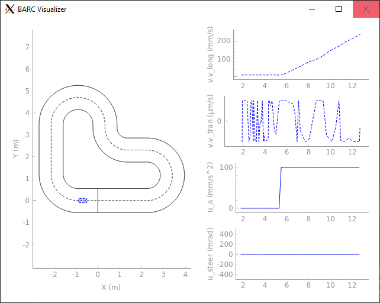

# An Tutorial on Developing for the ME 131 Class Project

This tutorial assumes that you have the Docker environment set up correctly according to the instructions in `docker_readme.md`. This tutorial will guide you through how to test your own controllers in simulation with ROS, to log the generated data, and to visualize it. Though it is not required, if you would like to learn more about ROS, you can find documentation on it [here](https://docs.ros.org/en/foxy/index.html).

## Setting up your Project Files

Let us begin by setting up directories for your project code and the data which will be generated. These directories will be mounted into the container where a script has been provided to easily copy your source code to the correct location and rebuild the relevant ROS packages.

- In a location of your choice, create a directory with the name `project_files` and subdirectories called `code` and `data`. 

- Create an empty file in `code` called `project_controller.py` and copy the controller template from [here](https://github.com/MPC-Berkeley/barc_lite/blob/main/workspace/src/mpclab_controllers/mpclab_controllers/lib/mpclab_controllers/project_controller.py) into that file. You will be modifying the class definition provided in this file for your project.

- You should have a directory with the following structure
    ```
    project_files
        - code
            - project_controller.py
        - data
            - <empty>
    ```

***NOTE***: The directory `project_files/code` may contain other files which are used in `project_controller.py`. For example, a tracking reference, utilities library, etc. These files will all be included when the ROS package is built.

## Launching the Docker Container

Now, we will launch the Docker container using the flags that were discussed in [`docker_readme.md`](docker_readme.md). For this example, I have set up the project directory at `C:\Users\zhued\Documents\`. I will refer to this path as `<PREFIX>` for the remainder of this tutorial. When following along, make sure to replace `<PREFIX>` with the location you have chosen.

For this Docker container, I would like to mount the `project_files/code` and `project_files/data` directories to `/project_code` and `/project_data` inside the container respectively, enable graphical forwarding via x11, and expose the port 8888 in order to use Jupyter Lab for data visualization.

```
docker run -it -e DISPLAY=host.docker.internal:0 -p 8888:8888 -v <PREFIX>\project_files\code:/project_code -v <PREFIX>\project_files\data:/project_data mpclab/me131
```

Depending on the OS that you are using, you should modify the command appropriately, particularly where it pertains to graphical forwarding.

## Running the Simulation Experiment

Before modifying the controller template, let us run the simulation experiment as is. You should be able to find the template in its original form at `/barc_lite/workspace/src/mpclab_controllers/mpclab_controllers/lib/mpclab_controllers/project_controller.py`. The ROS node, which creates an instance of this controller class can be found at `/barc_lite/workspace/src/mpclab_controllers/mpclab_controllers/nodes/py_project_node.py`.

A quick look at the template shows that it will output a constant acceleration of 0.1 m/s^2 and steering angle of 0 radians as seen in the `step` method. We would then expect the simulated car to speed up at a constant rate and drive straight.

Let us now run the simulation experiment using the following command in the container

```
ros2 launch barc_launch barc_sim_project.launch.py
```

which launches ROS nodes as specified in the launch file `/barc_lite/workspace/src/barc_launch/barc_launch/launch/barc_sim_project/barc_sim_project.launch.py`. This should open up a window such as the one below which shows a top down view of the track and car on the left-hand side and time history plots of certain states and inputs on the right-hand side. The car should speed up and drive in a straight line until it drives off the track.



## Modifying the Controller

Now let's try modifying the controller to output a time-varying signal for both acceleration and steering. Note that this part of the tutorial can be used as an example of a workflow for your project.

Start by opening up the copy of `project_controller.py` in the directory that we created earlier. 

First let us add the import statement at the top of the file

```python
import numpy as np
```

Then, instantiate a variable for keeping track of the initial time instance by modifying the initialization method

```python
def initialize(self, vehicle_state: VehicleState):
    self.t0 = vehicle_state.t
```

Now in the `step` method, we need to compute the elapsed time every time the method is called and then compute the control action as a function of that elapsed time. We can do that by modifying the first few lines of `step` to

```python
def step(self, vehicle_state: VehicleState):
    t = vehicle_state.t - self.t0
    accel = 0.3*np.sin(t/1*(2*np.pi)) + 0.3
    steer = 0.2*np.sin(t/1*(2*np.pi))
    vehicle_state.u.u_a = accel
    vehicle_state.u.u_steer = steer
```

which will result in the acceleration oscillating between 0 and 0.6 m/s^2 and steering oscillating between -0.2 and 0.2 radians both with a period of 1 second. Note that the definition of the `VehicleState` dataclass can be found [here](https://github.com/MPC-Berkeley/barc_lite/blob/8260d93c1922d0b01537ada339514e1fee795b6d/workspace/src/mpclab_common/mpclab_common/lib/mpclab_common/pytypes.py#L300).

Now it is important to note here that we have modfied the version of `project_controller.py` on the host machine, and thereby in `/project_code` of the container by virtue of directory mounting. However, if we were to run the experiment again, we would see no difference in behavior. This is because we have not changed the actual code which is being built into the ROS package. To do so, we have provided you with the `bash` script `/barc_lite/workspace/copy_and_build.sh`, which is reproduced below

```bash
#!/bin/bash

# Change this to where you mounted the directory containing your code
export MOUNT_DIRECTORY="/project_code" 

# Copy contents of mounted directory to 
# /barc_lite/workspace/src/mpclab_controllers/mpclab_controlers/lib/mpclab_controllers
cp -r ${MOUNT_DIRECTORY}/* /barc_lite/workspace/src/mpclab_controllers/mpclab_controllers/lib/mpclab_controllers

# Change directory to ROS workspace
cd /barc_lite/workspace

# Delete existing packages
rm -rf build log install

# Rebuild ROS packages
colcon build --symlink-install
```

To run this script, navigate to the directory `/barc_lite/workspace` in the container and use the command

```bash
./copy_and_build.sh
```

This will then copy the contents of `/project_code` (by default) into the correct directory then rebuild the ROS packages. After executing this script, if we were to run the experiment again, we should see the speed and heading of the car oscillate.

While you can certainly modify the version of `project_controller.py` at `/barc_lite/workspace/src/mpclab_controllers/mpclab_controllers/lib/mpclab_controllers/project_controller.py` directly, the reason we have set up this workflow is to minimize the chance that you lose the changes you made if the container gets deleted, since storage in a container is ephemeral.

While you are free to design your controller however you want, keep in mind that it needs to run at **10 Hz** on a desktop with an Intel Core i9-12900KF CPU and 64 GB of RAM. This is especially important if you plan on designing any optimization based control. The container comes with `numpy`, `scipy`, and [`casadi`](https://web.casadi.org/), which contains tools for performing optimization based control design.

## Modifying the Vehicle Dynamics Simulator

You may also modify the parameters of the vehicle dynamics simulator. The file which contains these values is located at `/barc_lite/workspace/src/barc_launch/barc_launch/config/barc_sim_project/barc_1/vehicle_simulator.yaml`. The default values can be seen [here](https://github.com/MPC-Berkeley/barc_lite/blob/main/workspace/src/barc_launch/barc_launch/config/barc_sim_project/barc_1/vehicle_simulator.yaml). To edit the file, use the following commands:

```bash
cd /barc_lite/workspace/src/barc_launch/barc_launch/config/barc_sim_project/barc_1
nano vehicle_simulator.yaml
```

This will open up the file using the text editor `nano`. Some key parameters that you may want to modify are `delay`, which allows you to specify the input delay in seconds, and `initial_config`, which allows you to set the initial condition of the vehicle. After you've made your edits, press `ctrl + o` and `enter` to save the file and then `ctrl + x` to exit the text editor. 

***NOTE***: This method of editing the parameter file is not permanent and the default values will be restored when starting a new container.

## Visualizing the Logged Data

By default, each time you run the experiments from the previous section, the data from the experiment is logged by way of a [rosbag](https://docs.ros.org/en/foxy/Tutorials/Beginner-CLI-Tools/Recording-And-Playing-Back-Data/Recording-And-Playing-Back-Data.html). You should see a folder show up in `<PREFIX>/project_files/data` with a name similar to `barc_sim_project_12-23-2022_16-55-57`. These folders contain SQL databases which have recorded the ROS messages which were published to certain topics, e.g. the vehicle state, actuation commands, predictions, etc..

We have provided you with a Jupyter notebook which provides an example on how to unpack the data and plot it. It is located at `/barc_lite/notebooks/plot_run_data.ipynb`.

To access it, start up the Jupyter Lab server at the root of the container filesystem and follow the instructions from `docker_readme.md` to connect to the server using your browser of choice.

```bash
cd /
jupyter lab --allow-root --ip=0.0.0.0
```

Open up the notebook by navigating to the containing directory and double clicking on the notebook file in the file browser pane to the left.

In the second cell of the notebook, set the variable `db_dir` to the name of the data folder you want to visualize then run the notebook. You should see two plots show up. The first is a top down view of the track with the x-y trace of the car plotted on it. The second is a set of time history subplots for some of the vehicle states and inputs.

## Working with the Track Object
We have additionally provided you with a Jupyter notebook with examples on how to interact with the track object to retrieve information such as the positions of the track boundaries and how to convert between global and local frame coordinates via a class method of the track object. It is located at `/barc_lite/notebooks/track_demo.ipynb`. For reference, the definition of the track class can be found [here](https://github.com/MPC-Berkeley/barc_lite/blob/main/workspace/src/mpclab_common/mpclab_common/lib/mpclab_common/tracks/radius_arclength_track.py).

## BARC Vehicle Parameters

The vehicle is built on top of the [Traxxas 1/10th scale 4-Tec 2.0 VXL AWD Chassis](https://traxxas.com/products/models/electric/4-tec-2-vxl-chassis).

- CoM to front axel: $0.13 \ m$
- CoM to rear axel: $0.13 \ m$
- Vehicle length: $0.37 \ m$
- Vehicle width: $0.19 \ m$
- Mass: $2.2187 \ kg$
- Yaw inertia: $0.02723 \ kg \cdot m^2$
- Wheel friction coefficient: $0.9$
- Drag coefficient: $0$
- Pacejka coefficients:
  - B: $5$
  - C: $2.28$
- Steering angle upper bound: $0.43 \ rad$
- Steering angle lower bound: $-0.43 \ rad$
- Acceleration upper bound: $1.0 \ m/s^2$
- Acceleration lower bound: $-2.0 \ m/s^2$
